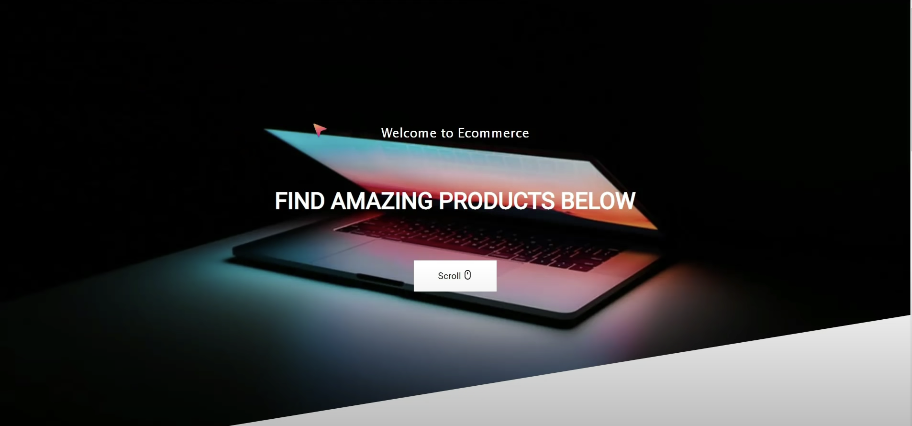
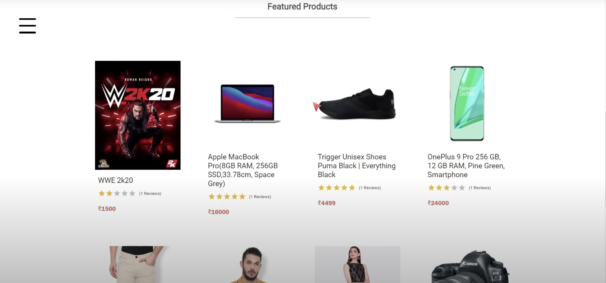
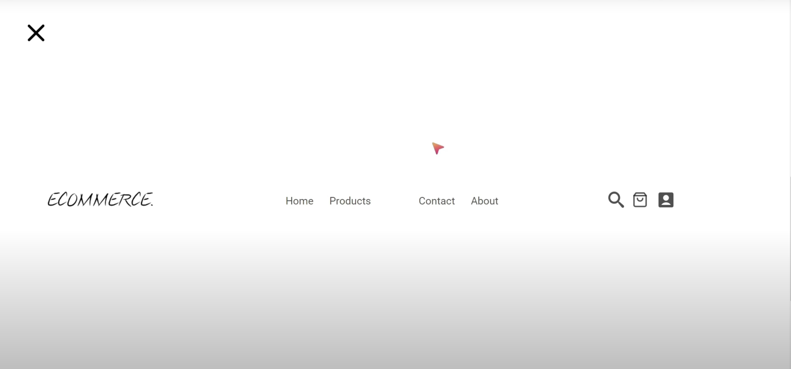

# 🚀 MERN E-COMMERCE TUTORIAL

This is an ecommerce website made with Mern Stack , learnt from Youtube.

# 👀 Prerequisite

Must have basic knowledge of **Node**, **React**, **Express**, **MongoDB**

# 🔍 Install Dependencies

**For Backend** - `npm i`

**For Frontend** - `cd frontend` (change directory to frontend) ` npm i`

## ✋🏻 Env Variables

Make Sure to Create a config.env file in backend/config directory and add appropriate variables in order to use the app.

**Essential Variables**

```
PORT=
DB_URI =
STRIPE_API_KEY=
STRIPE_SECRET_KEY=
JWT_SECRET=
JWT_EXPIRE=
COOKIE_EXPIRE=
SMPT_SERVICE =
SMPT_MAIL=
SMPT_PASSWORD=
SMPT_HOST=
SMPT_PORT=
CLOUDINARY_NAME
CLOUDINARY_API_KEY
CLOUDINARY_API_SECRET
```

👆🏻
_fill each filed with your info respectively_

# Demo:

</br>
</br>
Landing page :
</br>
</br>

</br>
</br>
Home Page:
</br>
</br>

</br>
</br>
hamburger:
</br>
</br>


 <br/>
  <p align = "center">Show Some Love, &#11088; the Repositories! </p>
